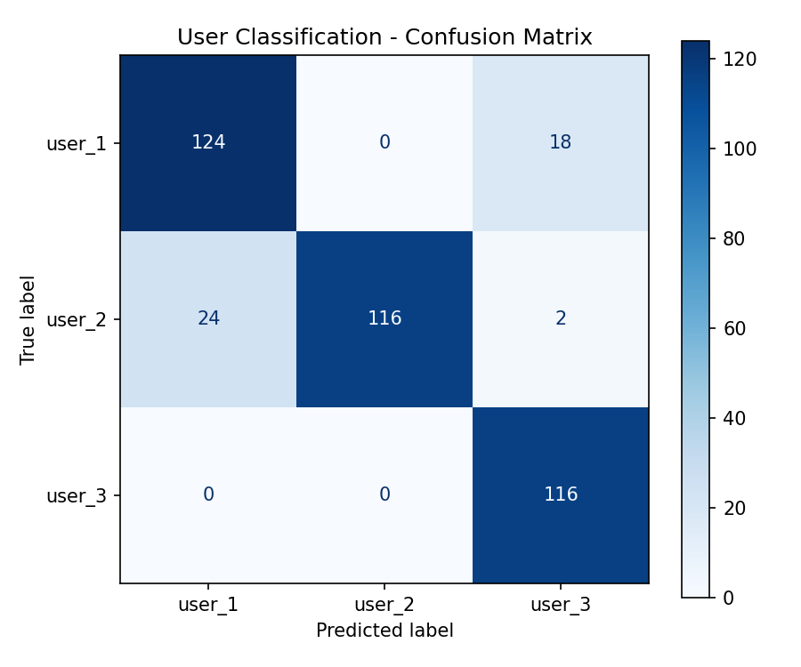
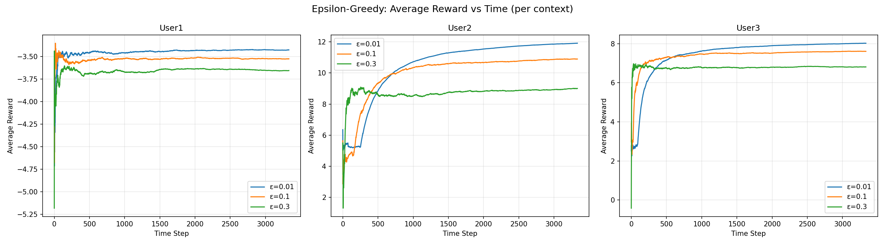
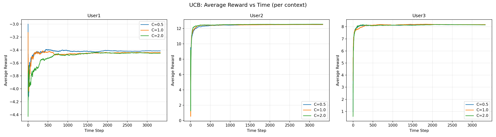
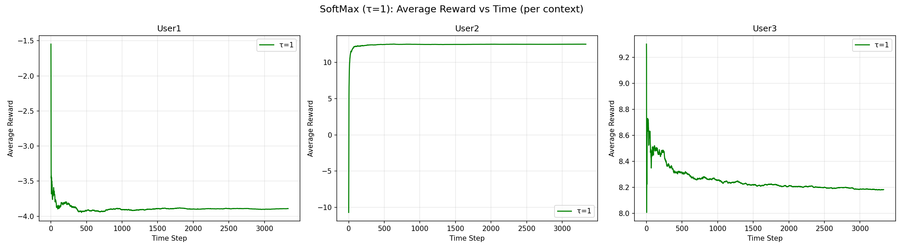
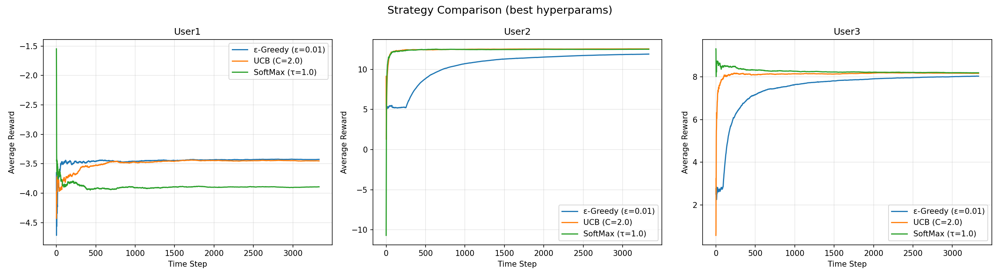
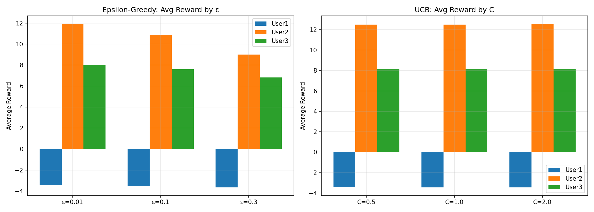

# Lab 3: Contextual Bandit for News Recommendation

**Name:** Aryan Gosain  
**Roll Number:** U20230108  
**Branch:** aryan_U20230108

---

## Overview

In this lab, the task was to implement a **Contextual Multi-Armed Bandit (CMAB)** system to recommend news articles. The main goal was to figure out which news category (like Tech or Entertainment) different types of users prefer. By treating user types as "contexts" and news categories as "arms", the algorithm learns to make better recommendations over time.

The project involved:
1. Cleaning and processing the user/article data.
2. Building a classifier to group users into contexts (User1, User2, User3).
3. Implementing three bandit algorithms (Epsilon-Greedy, UCB, SoftMax) to learn preferences.
4. Using these algorithms to recommend articles to test users.

---

## How to Run

### Prerequisites
- Python 3.12+
- Jupyter Notebook or JupyterLab

### Installation

```bash
# Clone the repository
git clone <repository-url>
cd lab3-contextual-bandit

# Create and activate virtual environment
python3 -m venv venv
source venv/bin/activate  # On Windows: venv\Scripts\activate

# Install dependencies
pip install pandas numpy scikit-learn matplotlib rlcmab-sampler
```

### Running the Notebook

```bash
source venv/bin/activate
jupyter notebook lab3_results_U20230108.ipynb
```

Running all the cells in order will generate the results and plots.

---

## Approach

### 5.1 Data Pre-processing

**Datasets Used:**
- `train_users.csv` – 2,000 user records (labeled)
- `test_users.csv` – 2,000 user records (unlabeled)
- `news_articles.csv` – Large dataset of news articles (~209k)

**Processing Steps:**
1. **Removed Duplicates**: Duplicate rows were dropped to ensure data quality.
2. **Fixed Missing Values**: The `age` column was missing a lot of data (~35%). These were filled with the median age instead of the mean, as the median handles outliers better.
3. **Encoding Features**:
   - `StandardScaler` was used for the 28 numeric features to bring them to the same scale.
   - Categorical features like browser version and region were converted using One-Hot Encoding.
4. **Result**: The final feature matrix contained 130 columns.

### 5.2 User Classification (Context Detection)

To determine the "context" for each user, a **Logistic Regression** classifier was trained. This model predicts whether a user falls into User1, User2, or User3 categories.

| Config | Value |
|--------|-------|
| Train/Validation Split | 80/20 |
| Stratification | Yes (to keep class balance) |
| Max Iterations | 2000 |
| Random State | 42 |

After validating the performance, the model was retrained on the full training dataset to apply it to the test users.

### 5.3 Contextual Bandit Algorithms

The bandit setup consists of **3 user contexts × 4 news categories = 12 total arms**. The sampler index `j` is mapped as follows:

| j | News Category | User Context |
|---|---------------|--------------|
| 0–3 | Entertainment, Education, Tech, Crime | User1 |
| 4–7 | Entertainment, Education, Tech, Crime | User2 |
| 8–11 | Entertainment, Education, Tech, Crime | User3 |

The sampler was initialized with roll number `i=108`, and the simulation ran for 10,000 steps.

#### 5.3.1 Epsilon-Greedy

Epsilon-Greedy is a simple strategy: with probability ε, it explores a random arm; otherwise, it exploits the current best arm.
Tested values: **ε = {0.01, 0.1, 0.3}**.

#### 5.3.2 Upper Confidence Bound (UCB)

UCB aims to maximize `Q(a) + C × √(ln(t) / N(a))`. This formula adds a bonus to less-explored arms. As an arm is chosen more often, the bonus shrinks, naturally reducing exploration over time.
Tested values: **C = {0.5, 1.0, 2.0}**.

#### 5.3.3 SoftMax

SoftMax picks arms probabilistically based on their estimated values rather than making a hard choice. Better arms have a higher chance of being picked.
Parameter used: **τ = 1.0**.

### 5.4 Recommendation Engine

The final pipeline works like this:
1. **Classify**: Take a test user and predict their context (User1/2/3).
2. **Select Category**: Query the bandit algorithm (using the best policy) for a news category.
3. **Recommend**: Randomly select an article from that category in the CSV file.

This process was run for all 2,000 test users to generate the recommendations.

---

## Results

### Classification Performance

The classifier performed well on the validation set:

| User Category | Precision | Recall | F1-Score | Support |
|--------------|-----------|--------|----------|---------|
| user_1 | 0.8378 | 0.8732 | 0.8552 | 142 |
| user_2 | 1.0000 | 0.8169 | 0.8992 | 142 |
| user_3 | 0.8529 | 1.0000 | 0.9206 | 116 |
| **Overall Accuracy** | | | **0.8900** | 400 |

#### Confusion Matrix



User3 is classified perfectly, while there is some slight confusion between User1 and User2. Overall, ~89% accuracy is solid for context detection.

### Test Set Context Distribution

Applying the classifier to the test set resulted in the following distribution:

| Context | Count |
|---------|-------|
| User1 (0) | 609 |
| User2 (1) | 666 |
| User3 (2) | 725 |

### Bandit Results

#### Epsilon-Greedy: Average Reward vs Time



The lower ε (0.01) clearly performs best in the long run. The high ε (0.3) continues to explore (make random choices) even late in the simulation, which drags down the average reward.

#### UCB: Average Reward vs Time



UCB shows a smoother convergence. All C values eventually reach good performance, but lower C values get there faster by stopping exploration sooner.

#### SoftMax: Average Reward vs Time



SoftMax with τ=1 works effectively, gradually shifting focus to the best arm.

#### Strategy Comparison (Best Hyperparameters)



Comparing the best version of each algorithm: ε-Greedy (0.01) and UCB perform very similarly. SoftMax is decent but slightly lags behind in some contexts.

#### Hyperparameter Comparison



This chart confirms that for ε-greedy, a small epsilon is preferable. For UCB, performance is fairly robust across different C values.

---

## Observations & Analysis

### Strategy Comparison

- **Epsilon-Greedy**: This was definitely the easiest one to wrap my head around. I found that a small epsilon (like 0.01) worked really well because it quickly locked onto the best option. But when I tried a bigger epsilon (0.3), it kept exploring way too much, even after it clearly knew which arm was best. It felt a bit wasteful to keep picking random options 30% of the time.

- **UCB**: I really liked how UCB handles exploration automatically. The math basically gives a "bonus" to arms we haven't tried much, so it explores naturally at the start and then settles down as it gathers data. I didn't have to worry about tuning a fixed probability like with epsilon-greedy, which was nice.

- **SoftMax (τ=1)**: This one felt a bit more sophisticated. Instead of just flipping a coin to explore, it picks arms based on how good they look. With τ=1, it wasn't super aggressive about exploring but also didn't just greedily pick the winner every time. It seemed to smoothly shift towards the best arm as the estimates got better.

### Hyperparameter Sensitivity

- **Epsilon (ε-Greedy):** A tiny epsilon (0.01) definitely gave the best final rewards because it spent most of its time exploiting the winner. The big epsilon (0.3) just hurt the long-term performance, so it's like it never fully stopped guessing.

- **C (UCB):** The C parameter basically limits how "curious" the algorithm is. A small C (0.5) made it exploit pretty quickly, while a larger C (2.0) made it explore a lot more before settling. I found C=1.0 to be a pretty good balance for this specific problem.

### Key Takeaways

1. It was cool to see that all three algorithms actually figured out the best news category for each user type.
2. I think UCB is probably the most reliable overall because it stops exploring so much once it's confident, unlike epsilon-greedy which keeps making random choices.
3. The classifier got around 89% accuracy, which seems good enough, even if it's wrong sometimes, the bandit algorithm will still try to find the best article for that "wrong" context.
4. Building the whole pipeline from classification to bandit selection to article recommendation was a great way to see how these parts fit together in a real system.

---

## Repository Structure

```
lab3-contextual-bandit/
├── README.md                          # Project report (this file)
├── lab3_results_U20230108.ipynb       # Main notebook with all code and results
├── assignment.pdf                     # Lab assignment specification
├── plots/
│   ├── confusion_matrix.png           # Classification confusion matrix
│   ├── epsilon_greedy_avg_reward.png  # ε-Greedy avg reward vs time
│   ├── ucb_avg_reward.png             # UCB avg reward vs time
│   ├── softmax_avg_reward.png         # SoftMax avg reward vs time
│   ├── strategy_comparison.png        # All strategies compared
│   └── hyperparameter_comparison.png  # ε and C bar chart comparison
├── data/
│   ├── train_users.csv                # Labeled training user data
│   ├── test_users.csv                 # Unlabeled test user data
│   └── news_articles.csv             # News articles dataset
└── venv/                              # Python virtual environment
```

---

*Last Updated: February 2026*
